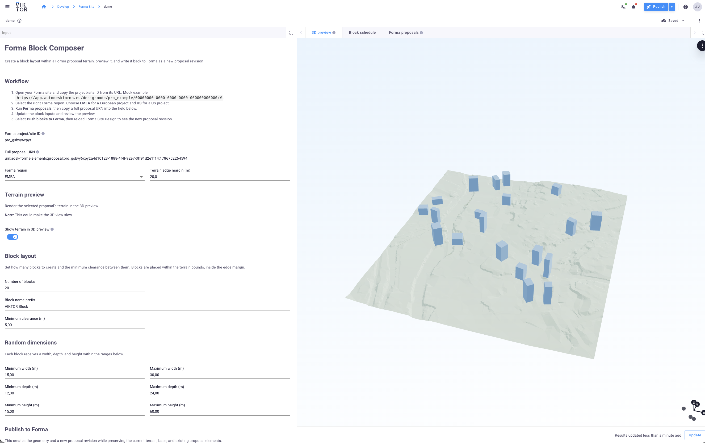
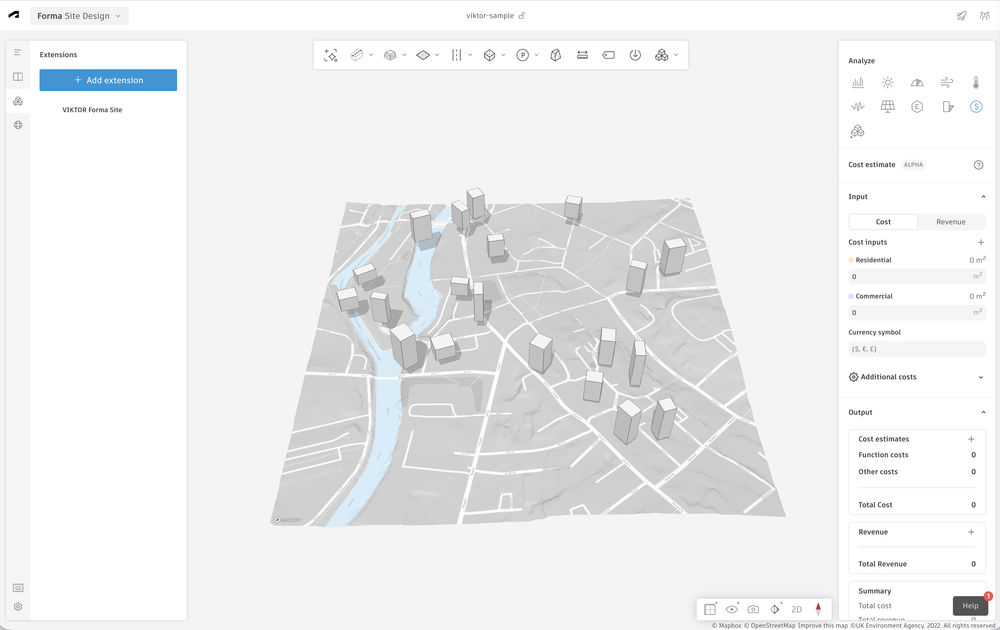
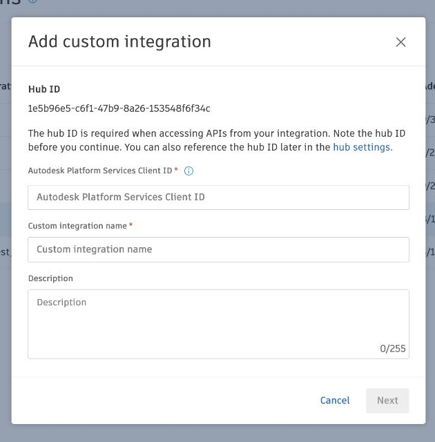
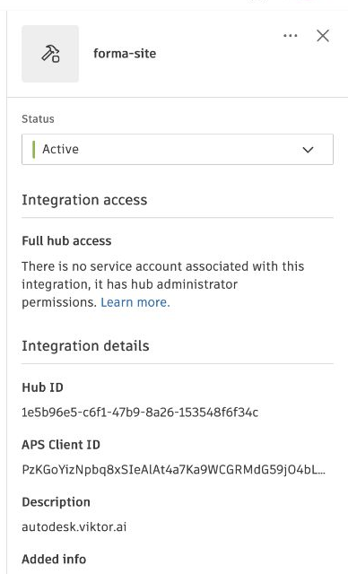
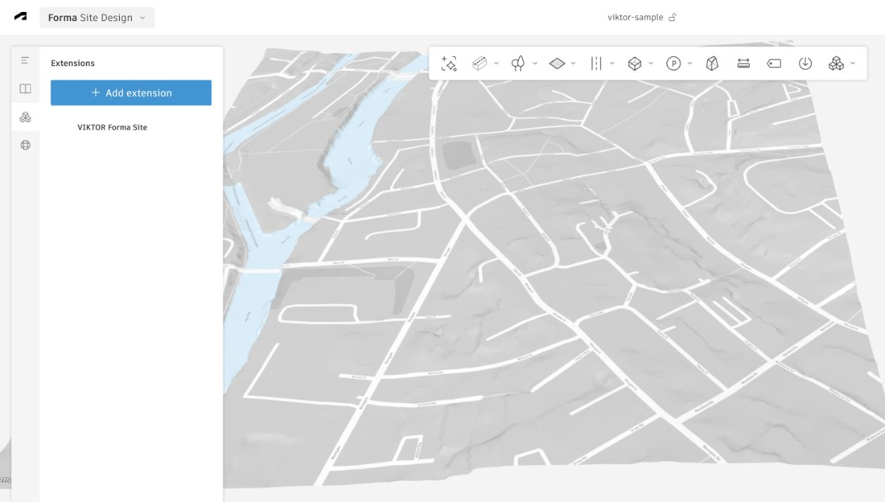
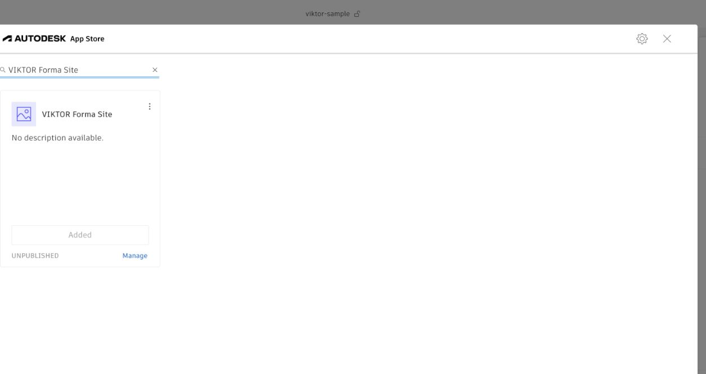
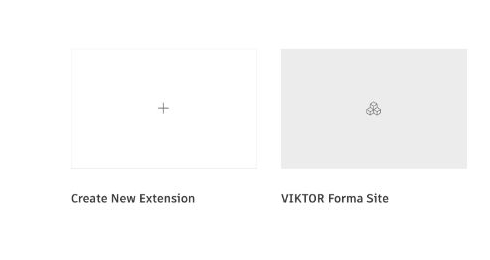
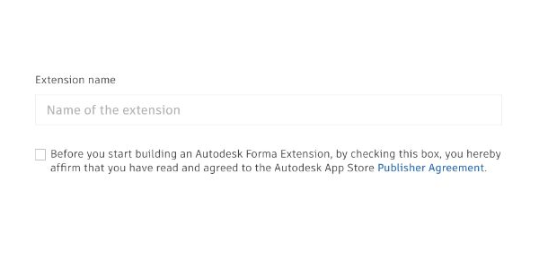
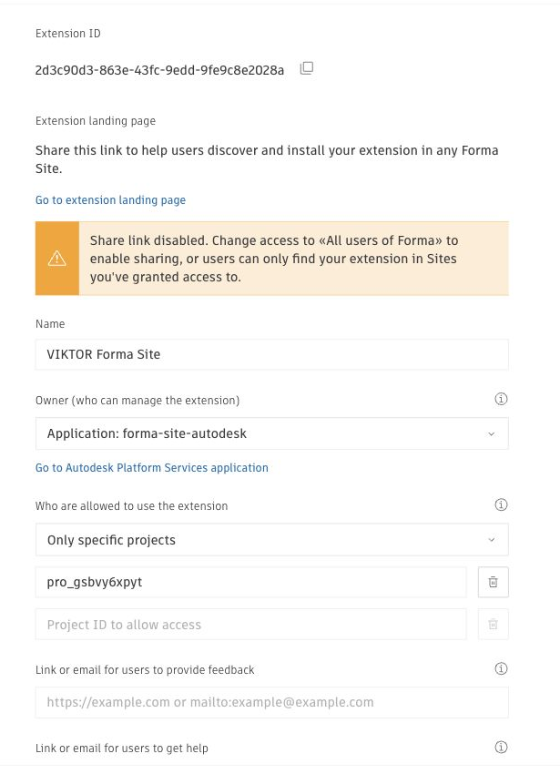
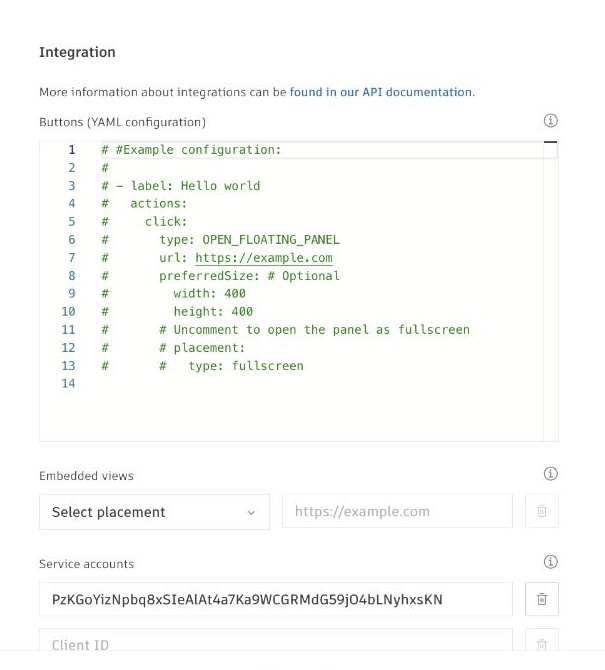

# VIKTOR Forma Site Integration

Generate building blocks inside a Forma proposal terrain, review the layout in VIKTOR, and publish the blocks as a new Forma proposal revision.





## What it does

1. Reads a selected Forma proposal and its terrain bounds.
2. Generates building blocks inside those bounds.
3. Shows the optional terrain preview and a block schedule in VIKTOR.
4. Creates the blocks in Forma and attaches them to a new proposal revision.

## Setup

### 1. Create the APS application

Follow the [official VIKTOR APS setup documentation](https://docs.viktor.ai/docs/create-apps/software-integrations/autodesk-platform-services/) to create an Autodesk Platform Services (APS) application, enable the Forma Site Design API, and copy its client ID and client secret.

- Add this callback URL in APS: `<your-viktor-environment>/api/integrations/oauth2/callback/`
- For example, use `https://demo.viktor.ai/api/integrations/oauth2/callback/` for `demo.viktor.ai`, or `https://autodesk.viktor.ai/api/integrations/oauth2/callback/` for `autodesk.viktor.ai`.
- Use the minimum scopes required. This app reads terrain and proposals and creates geometry and proposal revisions, so it normally needs `data:read`, `data:write`, and `data:create`.

### 2. Create the VIKTOR OAuth2 integration

In the VIKTOR Administrator panel, create an **Autodesk Platform Services** OAuth 2.0 integration:

- Name: `forma-site`
- Authentication URL: `https://developer.api.autodesk.com/authentication/v2/authorize`
- Token URL: `https://developer.api.autodesk.com/authentication/v2/token`
- Client ID and secret: the values from the APS application
- Assign the integration to this app.

The name must match both `oauth2_integrations` in `viktor.config.toml` and `OAuth2Integration("forma-site")` in the code.

Video walkthrough: [Integrate your VIKTOR app with Autodesk Construction Cloud](https://vimeo.com/1143370907).

### 3. Add the APS client ID to the ACC Hub

An ACC Account Admin must add the APS application as a custom integration:

1. Open **Account Administration** → **Custom integrations**.
2. Select **Add custom integration**.
3. Enter the same APS client ID used in VIKTOR.
4. Give it a recognizable name, grant the required hub or project access, and activate it.



Verify that the integration is active and shows the expected APS client ID and access level.



The last part of the [VIKTOR ACC integration video](https://vimeo.com/1143370907) also walks through the ACC Hub and Forma extension setup below.

### 4. Create and install the Forma extension

The ACC custom integration is not enough for Forma Site Design HTTP APIs. The same APS client ID must be added to a Forma extension as a service account.

1. Open the target Forma project and go to **Extensions** → **Add extension**.



2. In the Autodesk App Store dialog, select the settings icon in the upper-right corner and open **Manage**.



3. Select **Create New Extension**.



4. Name the extension, accept the Publisher Agreement, and select **Create**.



5. Set the extension owner to the same APS application. Limit access to the required Forma projects, or allow all Forma users as appropriate. The test project used by this app is `pro_gsbvy6xpyt`.



> **Warning:** transferring extension ownership to an APS application is non-reversible. Confirm the selected APS application before saving.

6. Open the extension **Integration** settings, add a service account, and enter the same APS client ID used in VIKTOR and the ACC custom integration.



7. Save the extension, return to the target project's **Extensions** catalog, and install it. Repeat this for every project the app needs to access.

The extension's optional buttons, embedded views, endpoints, and bundles are not required for this VIKTOR app. The service-account configuration is the part that authorizes the HTTP API calls.

## Run

```bash
viktor-cli install
viktor-cli start
```

This is a VIKTOR `simple` app. Open the app, create an entity, then sign in through the configured APS integration.

## Use

1. Copy the Forma project/site ID (`pro_...`) from the Forma URL. For example, this app has been tested with `pro_gsbvy6xpyt`.
2. Select the correct region: `EMEA` or `US`.
3. Load or enter a complete proposal URN.
4. Set the block inputs and optionally enable the terrain preview.
5. Review the 3D view and block schedule.
6. Select **Push blocks to Forma**, then reload Forma Site Design to see the new proposal revision.

The terrain preview loads every terrain triangle and can make the 3D view slow.

## Troubleshooting

- `403 AccessDeniedException`: verify the APS OAuth2 integration, the ACC custom integration, the Forma extension service account, the selected region, and the user's project access.
- An ACC custom integration does not replace the Forma extension service-account setup.
- Use the latest full proposal URN before publishing; a stale revision cannot be updated.
- Geometry is visible in Forma only after the new proposal revision attaches the created element URNs.

## References

- [VIKTOR APS integration documentation](https://docs.viktor.ai/docs/create-apps/software-integrations/autodesk-platform-services/)
- [VIKTOR ACC integration video](https://vimeo.com/1143370907)
- [Autodesk Forma API documentation](https://aps.autodesk.com/en/docs/forma/v1/overview/getting-started)
